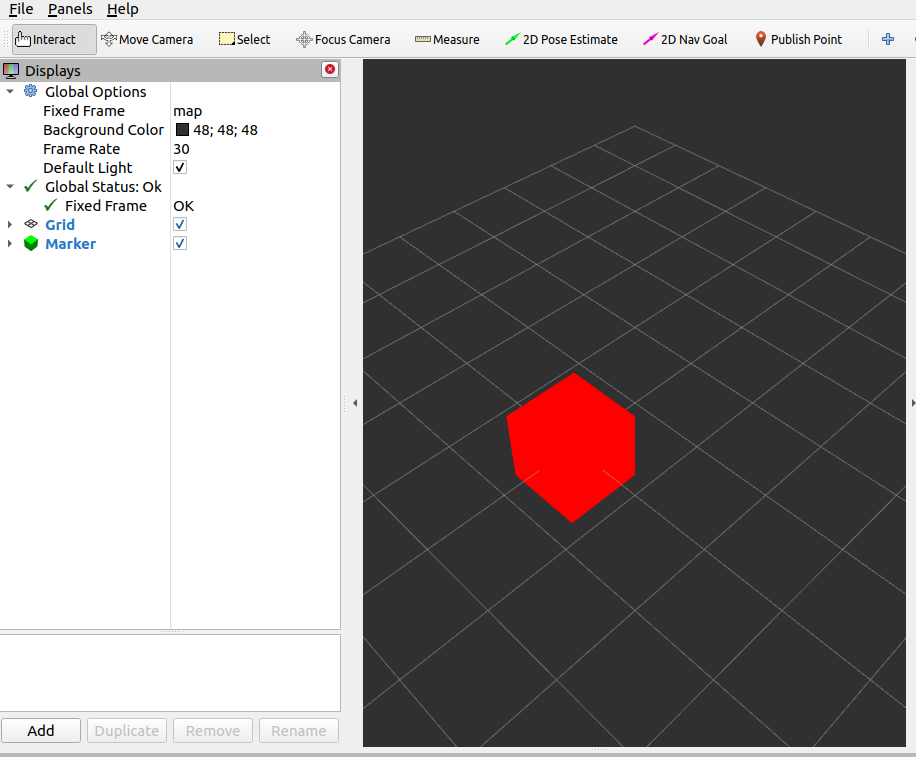

# ROS-tutorial
One simple example to learn about ROS1


#### System requirement
- Ubuntu 20.04 + ROS Noetic
  - Option I: [Using a VM on Windows](https://github.com/sutd-robotics/virtualbox-ubuntu-ros)
  - Option II: [Using Docker](https://varhowto.com/install-ros-noetic-docker/)    
  - Option III: Dual Boot! (There are lots of resources out there, and this is the most difficult option among the three. Choose with caution)

- Some of the above option might already contain installation steps for ROS Noetic, but if not, here is the [official installation document](http://wiki.ros.org/noetic/Installation/Ubuntu) 

## What does this repo do
### Write a simple publisher and subscriber with custom message type
1. create a workspace and its source folder
```bash
$ mkdir -p ~/catkin_ws/src
$ cd ~/catkin_ws
$ source /opt/ros/noetic/setup.bash (source /opt/ros/noetic/setup.zsh)
$ catkin_make
$ cd src
$ git clone git@github.com:ne-v0y/ROS-tutorial.git
$ cd ~/catkin_ws
$ catkin_make
$ source devel/setup.bash (source devel/setup.zsh)
```
2. go to `ROS-tutorial`, there are a few TODOs in the file, you need to create publisher and subscriber
3. to check your publisher is working, use command `rostopic list` to check see all live topics
4. to check your publisher is publishing content, use `rostopic echo` to check published content
5. to visualize bounding box, ues command `rviz` and in a new terminal run static tf publisher
```
rosrun tf static_transform_publisher 0 0 0 0 0 0 1 map my_frame 10
```
and use `Add` on the left bottom coner to add `by topic` and choose `Marker`, you should be able to see the following outcome
6. another way to run multiple nodes in one command is using `roslaunch`. I have added an example file, but has a bug in it. Can you figure it out?



## Useful links
https://mirror.umd.edu/roswiki/attachments/de/ROScheatsheet.pdf
